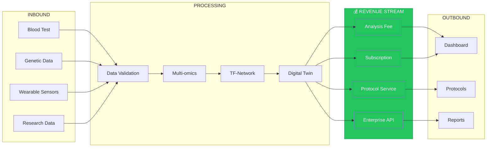
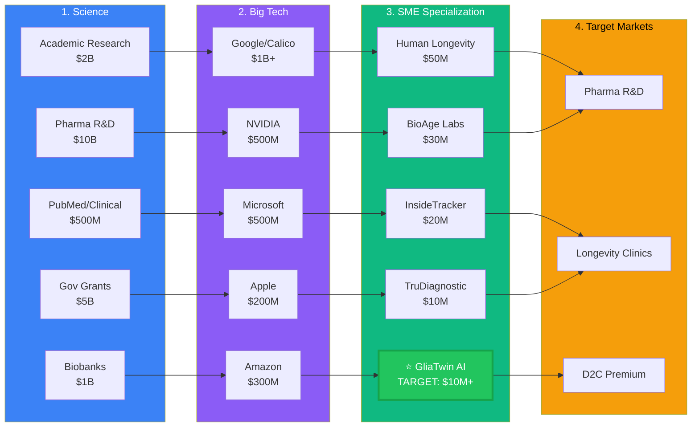

# Market Research

This folder contains market research, competitive analysis, and positioning strategies for GliaTwin AI.

## Contents

- Market size analysis
- Competitor profiling
- Target customer segments
- Pricing strategies
- Growth projections

## Key Findings

### Market Opportunity
- Longevity market: $600B+ by 2030
- Neurodegenerative disease market: $50B+
- AI in healthcare: $180B by 2030

### Target Segments
1. **B2B**: Pharma R&D, CRO, Neurology Clinics
2. **B2B2C**: Longevity Clinics, Wellness Programs
3. **D2C**: Premium Longevity Enthusiasts

## Competitors

| Company | Focus | Strength |
|---------|-------|----------|
| Calico/Alphabet | Longevity research | Resources, AI |
| Human Longevity Inc | Early detection | Large database |
| InsideTracker | Personalized health | Consumer focus |
| DeepMind | AI for biology | Research excellence |

## Value Chain Diagram

### Key Revenue Streams (Highlighted in Green)

| Stream | Opportunity | Estimated |
|--------|-------------|-----------|
| **Analysis Fees** | Test processing | $100-1000/test |
| **Subscription** | Ongoing platform | $50-500/month |
| **Protocol Service** | Treatment plans | $100-1000/plan |
| **Enterprise API** | B2B access | $10K-100K/year |

### Priority Revenue Blocks

1. **Digital Twin Creation** → $50-500/month subscription (RECURRING)
2. **Analysis Fees** → $100-1000/test (VOLUME)
3. **Longevity Path Gen** → $100-1000/plan (HIGH MARGIN)
4. **Enterprise API** → $10K-100K/year (B2B)

## Value Chain Economics

### Inbound Logistics

| Block | Cost | Revenue | Margin |
|-------|------|---------|--------|
| Blood Test Data | $50-200/test partner fee | Bundled | Included |
| Genetic Data | $20-100/test licensing | Bundled | Included |
| Wearable Sensors | $10-50/test API cost | Bundled | Included |
| Research Data | $100K-500K/year licensing | $200K-1M/year | 60-70% |

### Operations/Processing

| Block | Cost | Revenue | Margin |
|-------|------|---------|--------|
| Data Validation | $20K-100K/year infrastructure | $10-50/test | 60-70% |
| Multi-omics Integration | $50K-200K/year compute | $100-500/test | 70-80% |
| TF-Network Analysis | $100K-500K/year GPU | $200-1000/test | 75-85% |
| Digital Twin Creation | $200K-1M/year engine | $50-500/month sub | 65-75% |
| Longevity Path Gen | $300K-1M/year R&D | $100-1000/plan | 70-80% |
| Tracking & Optimization | $50K-300K/year infra | $20-100/month | 60-70% |

### Outbound Logistics

| Block | Cost | Revenue | Margin |
|-------|------|---------|--------|
| Dashboard | $20-50K/year CDN | Included | N/A |
| Protocols | $10-20K/year delivery | Included | N/A |
| Reports | $10-30K/year generation | $50-200/report | 70-80% |
| Clinician Alerts | $10K-50K/year | Enterprise deal | Included |

### Marketing & Sales

| Block | Cost | Revenue | Margin |
|-------|------|---------|--------|
| Web Portal | $50K-200K/year | Acquisition | CAC |
| Mobile App | $30K-100K/year | Retention | LTV |
| Clinician Network | $100K-500K/year sales | Enterprise deals | 10-20% |

### Service

| Block | Cost | Revenue | Margin |
|-------|------|---------|--------|
| Customer Support | $100K-500K/year team | Upsell | 5-10% |
| Data Updates | $20K-100K/year | Included | N/A |
| Consultation | $20-50K/year | $500-5000/hr | 60-70% |

## Pricing Matrix

| Tier | B2B Price | B2B2C Price | D2C Price |
|------|-----------|------------|-----------|
| **Basic** | $2K-10K/month | $100-200/month | $50/month |
| **Pro** | $10K-50K/month | $200-500/month | $150/month |
| **Enterprise** | $50K+/month | Custom | N/A |

## Growth Projections

### Year 1 (MVP)
- Revenue: $500K-1M
- Customers: 50 B2B, 500 B2B2C, 5K D2C
- CAC: $500-5K
- Burn: $1-2M

### Year 2 (Scale)
- Revenue: $3-5M
- Customers: 200 B2B, 5K B2B2C, 50K D2C
- CAC: $300-3K
- EBITDA: Break-even

### Year 3 (Growth)
- Revenue: $15-30M
- Customers: 500 B2B, 20K B2B2C, 200K D2C
- CAC: $200-2K
- EBITDA: $5-10M

## Market Sankey Diagram

### Market Flow Summary

### Where Our Project Fits

⭐ **GliaTwin AI** is positioned in Column 3 (SME Specialization) with:
- **Focus**: Digital Twin of Microglia for Predictive Neuroprotection
- **Target Revenue**: $10M+ ARR (scalable)
- **Advantage**: Unique niche (brain immune niche) vs competitors
- **Go-to-Market**: B2B → B2B2C → D2C

### Market Potential by Segment

| Segment | Market Size | Our Share Target |
|---------|------------|----------------|
| Pharma R&D | $10B | $2-5M |
| Longevity Clinics | $5B | $1-3M |
| D2C | $2B | $500K-2M |

## Contact

For business inquiries: business@gliatwin.ai