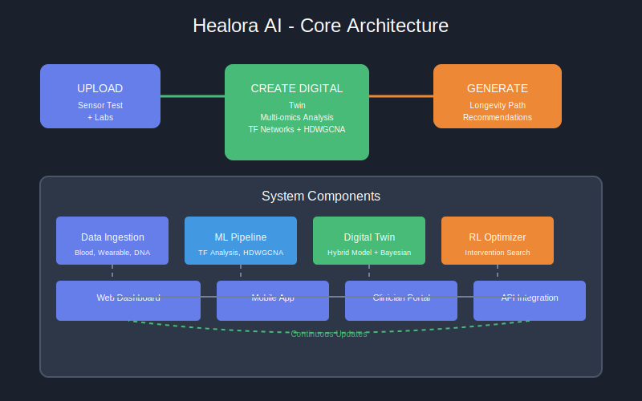

# Digital Twins + Longevity Path - Product Documentation

## Structure

```
UC-CJM-UIUX/
├── README.md                              # This file - main index
├── agenda.md                              # Documentation agenda and structure
├── PRODUCT_DESCRIPTION.md                 # Detailed product description
├── PRODUCT_DESCRIPTION copy.md            # Backup copy
├── CJM/                                   # Customer Journey Maps
│   ├── customer-journey-map.md            # Detailed CJM documentation
│   ├── customer-journey-map.puml          # PlantUML source
│   ├── customer-journey-map.pptx          # Presentation format
│   ├── customer-journey-map-presentation.md # Presentation notes
│   ├── create_pptx.py                     # PPTX generation script
│   └── create_simple_pptx.py              # Simple PPTX generation
├── images/                                # Architecture diagrams
│   ├── core_architecture.svg              # Core system architecture
│   ├── ai_ml_architecture.svg             # AI/ML pipeline architecture
│   └── data_pipeline.svg                  # Data flow architecture
└── [Planned]                              # Future documentation
    ├── use-cases/                         # Use case specifications
    ├── user-stories/                      # Agile user stories
    ├── ui-ux/                             # UI/UX designs and mockups
    └── wireframes/                        # Wireframe documents
```

## Quick Reference

| File | Description | Status |
|------|-------------|--------|
| [README.md](README.md) | This file - main index | Current |
| [agenda.md](agenda.md) | Documentation agenda and structure | Current |
| [PRODUCT_DESCRIPTION.md](PRODUCT_DESCRIPTION.md) | Detailed product description | Current |
| [CJM/customer-journey-map.md](CJM/customer-journey-map.md) | Customer journey map documentation | In Progress |
| [CJM/customer-journey-map.puml](CJM/customer-journey-map.puml) | PlantUML source for CJM | In Progress |
| [CJM/customer-journey-map.pptx](CJM/customer-journey-map.pptx) | Presentation format of CJM | In Progress |
| [CJM/customer-journey-map-presentation.md](CJM/customer-journey-map-presentation.md) | Presentation notes | In Progress |
| [images/core_architecture.svg](images/core_architecture.svg) | Core system architecture diagram | Current |
| [images/ai_ml_architecture.svg](images/ai_ml_architecture.svg) | AI/ML pipeline architecture | Current |
| [images/data_pipeline.svg](images/data_pipeline.svg) | Data flow architecture | Current |
| [Planned: use-cases/]() | Use case specifications | Planned |
| [Planned: user-stories/]() | Agile user stories | Planned |
| [Planned: ui-ux/]() | UI/UX designs and mockups | Planned |

---

## UX Documentation Structure

This folder contains user experience documentation for the Digital Twin + Longevity Path product:

### Planned Contents

| Document Type | Description | Status |
|---------------|-------------|--------|
| **Use Cases** | Detailed user interaction scenarios and functional requirements | Planned |
| **User Stories** | Agile format user requirements with acceptance criteria | Planned |
| **Customer Journey Maps** | Visual representation of user experience across touchpoints | In Progress |
| **UI/UX Design** | Wireframes, mockups, and design specifications | Planned |

### Existing Artifacts

#### Customer Journey Maps (`CJM/`)
- `customer-journey-map.md` - Detailed customer journey documentation
- `customer-journey-map.puml` - PlantUML source for visualization
- `customer-journey-map.pptx` - Presentation format
- `customer-journey-map-presentation.md` - Presentation notes

#### Supporting Materials
- `agenda.md` - Product documentation agenda and structure
- `PRODUCT_DESCRIPTION.md` - Detailed product description
- `PRODUCT_DESCRIPTION copy.md` - Backup copy of product description

### UX Workflow

1. **Research Phase**
   - User interviews and surveys
   - Competitive analysis
   - Persona development

2. **Design Phase**
   - Use case definition
   - User story creation
   - Journey mapping
   - Wireframing

3. **Validation Phase**
   - Usability testing
   - A/B testing
   - Iterative refinement

## Key Figures

### Digital Twin Pipeline


### Core Architecture


### AI/ML Architecture


### Data Pipeline


---

## Key Terms

| Term | Definition |
|------|------------|
| **Digital Twin (DT)** | Computational model that replicates individual's biological state |
| **Longevity Path** | Personalized intervention protocol for healthspan extension |
| **Multi-omics** | Integration of genomics, proteomics, metabolomics, transcriptomics |
| **TF-Network** | Transcription Factor - Gene interaction network analysis |
| **HDWGCNA** | Hierarchical Dynamic Weighted Gene Co-expression Network Analysis |
| **DAM** | Disease-Associated Microglia phenotype classification |
| **Microglia** | Brain immune cells critical for neuroprotection |
| **Healthspan** | Years of life spent in good health |
| **RAG** | Retrieval-Augmented Generation for LLM enhancement |
| **LLM** | Large Language Model for natural language processing |
| **Neural ODE** | Neural Ordinary Differential Equations for dynamic modeling |
| **Reinforcement Learning (RL)** | AI optimization for intervention protocols |

---

## UX Documentation Overview

This folder specifically focuses on User Experience (UX) documentation for the Digital Twin + Longevity Path product. The UX documentation includes:

1. **Use Cases** - Detailed scenarios of how different user types interact with the system
2. **User Stories** - Agile-formatted requirements with acceptance criteria
3. **Customer Journey Maps** - Visual representations of the user experience across all touchpoints
4. **UI/UX Design** - Wireframes, mockups, and design specifications

### Current UX Artifacts
- **Customer Journey Maps** are actively being developed in the `CJM/` directory
- **Architecture diagrams** are available in the `images/` directory
- **Product descriptions** provide context for UX design decisions

### Planned UX Documentation
Future documentation will include comprehensive use cases, user stories, and UI/UX designs to guide development and ensure user-centered design principles are applied throughout the product lifecycle.

## Product Overview

**Longivia** — AI-powered Digital Twin for Personalized Longevity

### Value Proposition
- **Input**: Blood test, genetic data, wearables, mental tests, lifestyle diary, medical history
- **Process**: Multi-omics integration → TF-Network Analysis → Digital Twin creation → RL optimization
- **Output**: Personalized longevity protocols, predictions, and continuous tracking

### Target Markets
- **TAM**: $800B+ (global longevity economy by 2030)
- **SAM**: $50B (premium longevity services)
- **SOM**: $500M-5B (initial target segments)

---

*Generated: AIMLEI-2026 | Skoltech*
