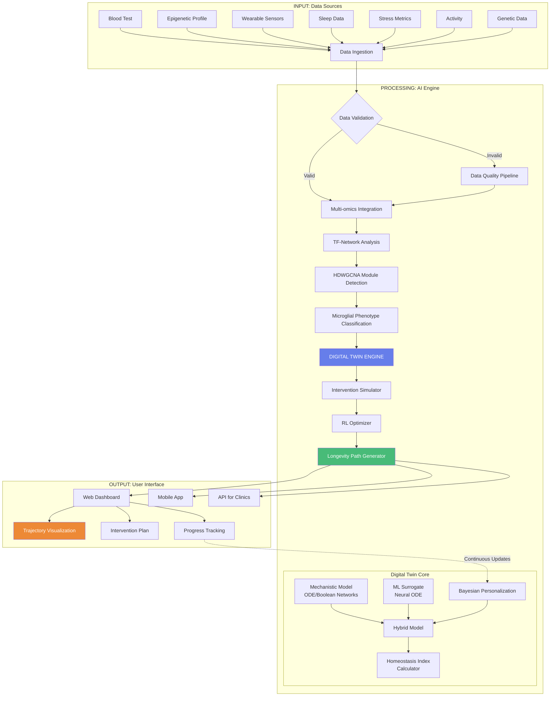
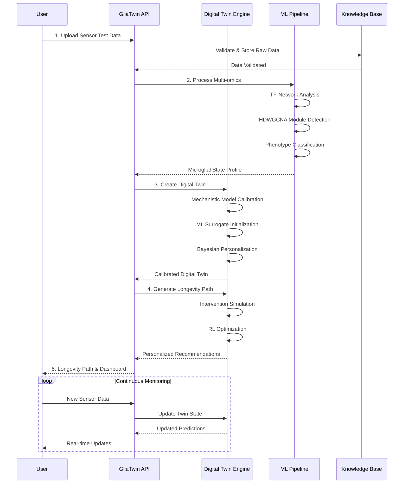
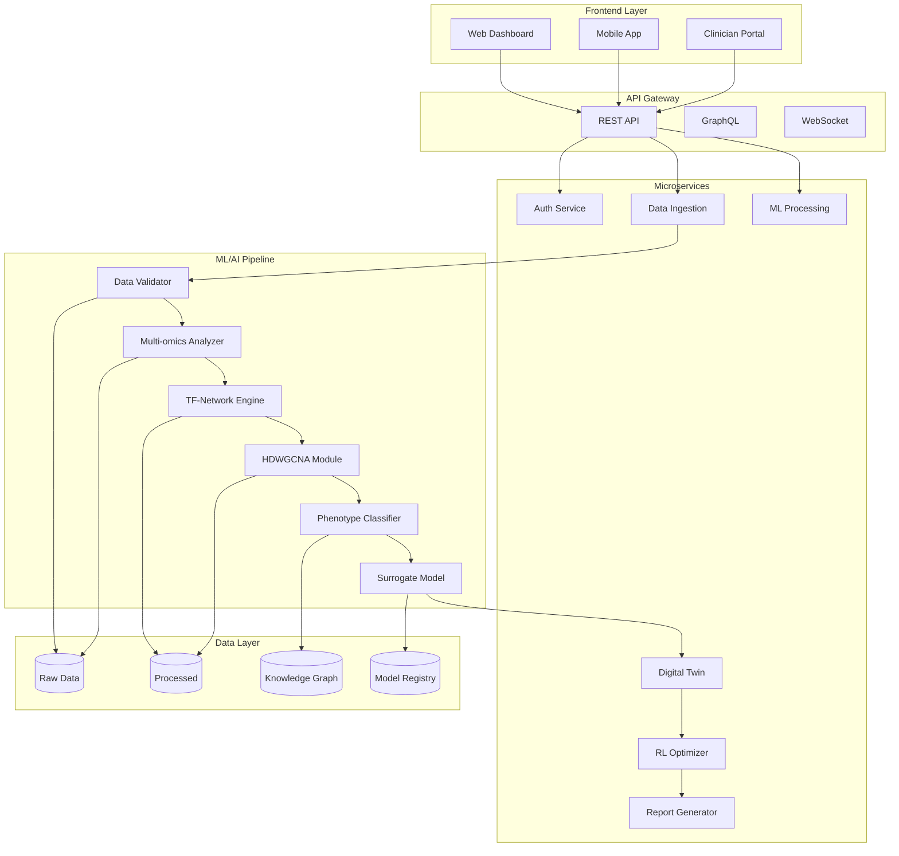
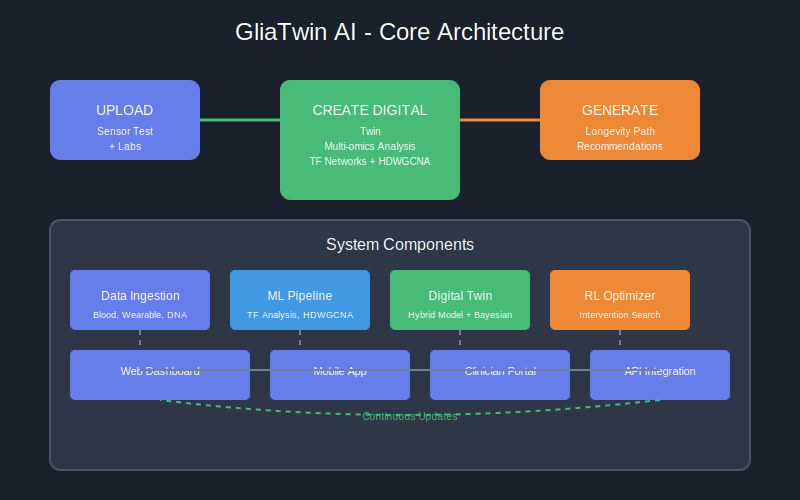
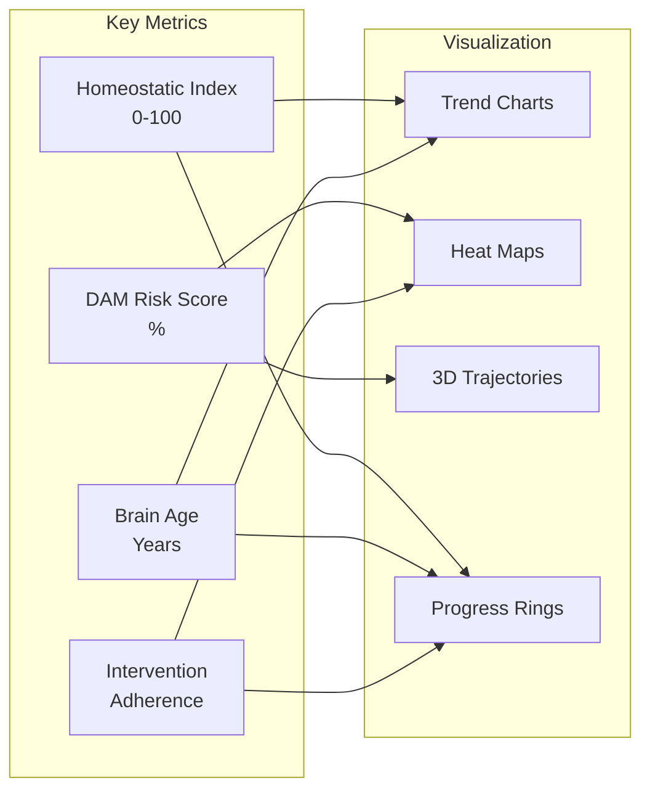
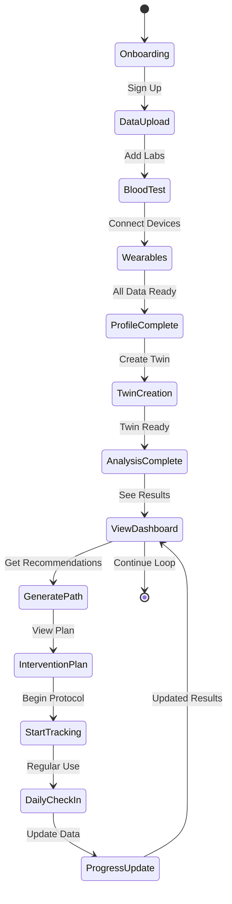
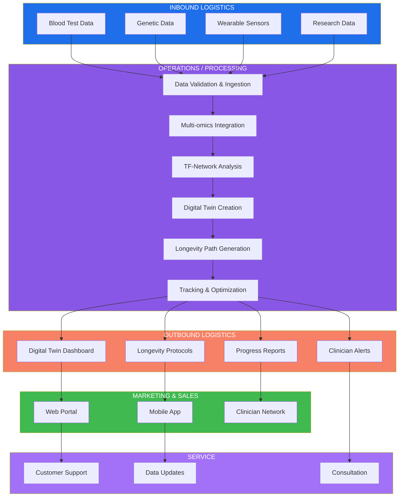

# GliaTwin AI - Product Description

## Executive Summary

**GliaTwin AI** — Digital Twin of Microglia for Predictive Neuroprotection. The product uses AI to analyze sensor/test data, creates a personalized microglia model, and generates individual longevity protocols.

---

## Product Flow (CJM)

```
+-------------------------------------------------------------------------------------+
|                           GLIATWIN AI - USER JOURNEY                                |
+-------------------------------------------------------------------------------------+

    +----------+     +------------------+     +-----------------+     +--------------+
    |  UPLOAD  | --> | CREATE DIGITAL   | --> |  GENERATE       | --> |   TRACK &    |
    |  SENSOR  |     |     TWIN         |     |  LONGEVITY PATH |     |   OPTIMIZE   |
    |   TEST   |     |                  |     |                 |     |              |
    +----------+     +------------------+     +-----------------+     +--------------+
         |                  |                        |                        |
         v                  v                        v                        v
    +----------+     +------------------+     +-----------------+     +--------------+
    |  Blood    |     |  Multi-omics     |     |  Personalized   |     |  Continuous  |
    |  Test     |     |  Analysis        |     |  Intervention   |     |  Monitoring  |
    |  + Wear   |     |  + TF Networks   |     |  Recommendations|     |  + RL Engine |
    |  Data     |     |  + HDWGCNA       |     |  + Predictions  |     |  + Updates   |
    +----------+     +------------------+     +-----------------+     +--------------+
```

---

## Architecture Diagram (Mermaid)



---

## Data Flow Diagram



---

## System Components



---

## Core Architecture



---

## AI/ML Subsystem Architecture


---

## Data Pipeline Architecture


---

## AI/ML Subsystem Details

### Machine Learning Pipeline Components

| Component | Description | Technology |
|-----------|-------------|------------|
| **Data Validator** | Quality control, normalization, imputation | Python, Pandas, NumPy |
| **Feature Engine** | Embedding generation, PCA, feature selection | scikit-learn, PyTorch |
| **TF-Network Analyzer** | Transcription factor interaction analysis (~2M interactions) | Graph Neural Networks (PyG) |
| **HDWGCNA Module Detector** | Weighted Gene Co-expression Network Analysis | R/Python hybrid |
| **Phenotype Classifier** | GPNMB+ DAM detection, state classification | Transformers, Ensemble Methods |
| **Trajectory Model** | DAM transition prediction, dynamics modeling | Neural ODE, VAE |

### Deep Learning Models

| Model | Purpose | Architecture |
|-------|---------|--------------|
| **Graph Neural Network** | TF-gene relationship modeling | Graph Attention Networks |
| **Transformer** | Sequence analysis, pattern detection | Multi-head self-attention |
| **Neural ODE** | Dynamic system modeling | Continuous-time neural networks |
| **Variational Autoencoder** | Latent space representation | beta-VAE architecture |
| **RL Agent** | Intervention optimization | PPO/A2C agents |
| **Bayesian Network** | Uncertainty quantification | Probabilistic graphical models |

### Data Processing Stages


---

## Key Metrics Dashboard



---

## User Experience Flow



---

## Technical Stack

| Component | Technology |
|-----------|------------|
| Frontend | React, Vue.js, D3.js |
| Backend | Python FastAPI, Node.js |
| ML/AI | PyTorch, TensorFlow, Transformers, PyG |
| Database | PostgreSQL, Neo4j, Redis |
| Infrastructure | Kubernetes, AWS/GCP |
| Visualization | Plotly, Mermaid, D3 |

---

## Product Features

### 1. Data Upload Module
- Blood test integration (epigenetic markers, cytokines)
- Wearable device connectivity (Oura, Whoop, Apple Watch)
- Genetic data import (23andMe, AncestryDNA)
- Manual input for lifestyle factors

### 2. Digital Twin Engine
- Multi-omics integration (transcriptomics, epigenomics, proteomics)
- TF-network analysis (~2M interactions)
- HDWGCNA module detection
- Bayesian personalization
- Hybrid mechanistic/ML architecture

### 3. Longevity Path Generator
- Personalized intervention recommendations
- Nutrient protocol optimization
- Lifestyle adjustments
- Sleep/circadian optimization
- Continuous RL-based refinement

### 4. Tracking & Optimization
- Real-time monitoring dashboard
- Progress visualization
- Adaptive recommendations
- Clinician alerts

---

## Market Position

**Positioning:** "The first digital twin of the brain's immune niche, predicting therapy response before dementia symptoms appear"

**Target Markets:**
- B2B: Pharma R&D, CRO, Neurology Clinics
- B2B2C: Longevity Clinics, Wellness Programs
- D2C: Premium Longevity Enthusiasts

---

## Value Chain



### Value Chain Details

| Stage | Activities | Cost Drivers | Revenue Streams |
|-------|------------|-------------|-----------------|
| **Inbound Logistics** | Data collection, partner integration | Lab partnership fees ($50K-200K/year), Wearable API costs ($10K-50K/year), Data licensing | Bundled with subscription |
| **Data Validation** | QC, normalization, imputation | Cloud infrastructure ($20K-100K/year), Validation algorithms | Included in analysis fee |
| **Multi-omics Integration** | Cross-platform data fusion | Compute costs ($50K-200K/year), Integration R&D | Analysis fee ($100-500/test) |
| **TF-Network Analysis** | Graph construction, interaction mapping | GPU clusters ($100K-500K/year), Research partnerships | Premium add-on ($200-1000/test) |
| **Digital Twin Creation** | Model calibration, personalization | Twin engine license ($200K-1M/year), ML training | Subscription ($50-500/month) |
| **Longevity Path Gen** | Intervention simulation, RL optimization | Algorithm development ($300K-1M/year) | Protocol service ($100-1000/plan) |
| **Tracking & Optimization** | Real-time updates, dashboard | Monitoring infrastructure ($50K-300K/year) | Ongoing subscription |
| **Outbound/Distribution** | Dashboard delivery, reports | CDN, delivery costs | Included in subscription |
| **Marketing & Sales** | Acquisition, brand | Ad spend ($100K-500K/year), Sales team | CAC built into LTV |
| **Service & Support** | Customer success | Support team ($100K-500K/year) | Upsell, retention |

### Unit Economics

| Metric | B2B | B2B2C | D2C |
|--------|-----|-------|-----|
| **CAC** | $5K-20K | $500-2K | $100-500 |
| **LTV** | $50K-500K | $5K-50K | $1K-10K |
| **LTV:CAC** | 10:1 | 10:1 | 10:1 |
| **Gross Margin** | 70-85% | 60-75% | 50-70% |

### Cost Structure

| Category | Fixed Costs | Variable Costs |
|----------|------------|---------------|
| **COGS** | Cloud infrastructure ($200K-1M/year) | Per-test processing ($10-100/test) |
| **R&D** | Algorithm development ($500K-2M/year) | Model updates ($50K-200K/year) |
| **Sales & Marketing** | Sales team ($300K-1M/year) | Ads ($100K-500K/year) |
| **Operations** | Platform ops ($200K-1M/year) | Support ($20-50/customer) |
| **Compliance** | Regulatory ($100K-500K/year) | Certifications ($10K-50K/approval) |

### Revenue Model

| Stream | Pricing | Description |
|--------|---------|-------------|
| **Subscription** | $50-500/month | Core platform access |
| **Analysis Fees** | $100-1000/test | One-time test processing |
| **Protocol Service** | $100-1000/plan | Treatment protocol generation |
| **Enterprise API** | $10K-100K/year | B2B API access |
| **Consulting** | $500-5000/hr | Clinical consultation |
| **Data Licensing** | Negotiated | Research data access |

---

## Roadmap

| Phase | Timeline | Milestones |
|-------|----------|------------|
| MVP | 1-3 months | Static twin on reference datasets, web interface |
| V1 | 4-8 months | Liquid biopsy integration, Bayesian calibration |
| Scale | 9-18 months | RL optimizer, FDA/EMA pathway preparation |

---

*Generated: April 2026 | AIMLEI-2026*